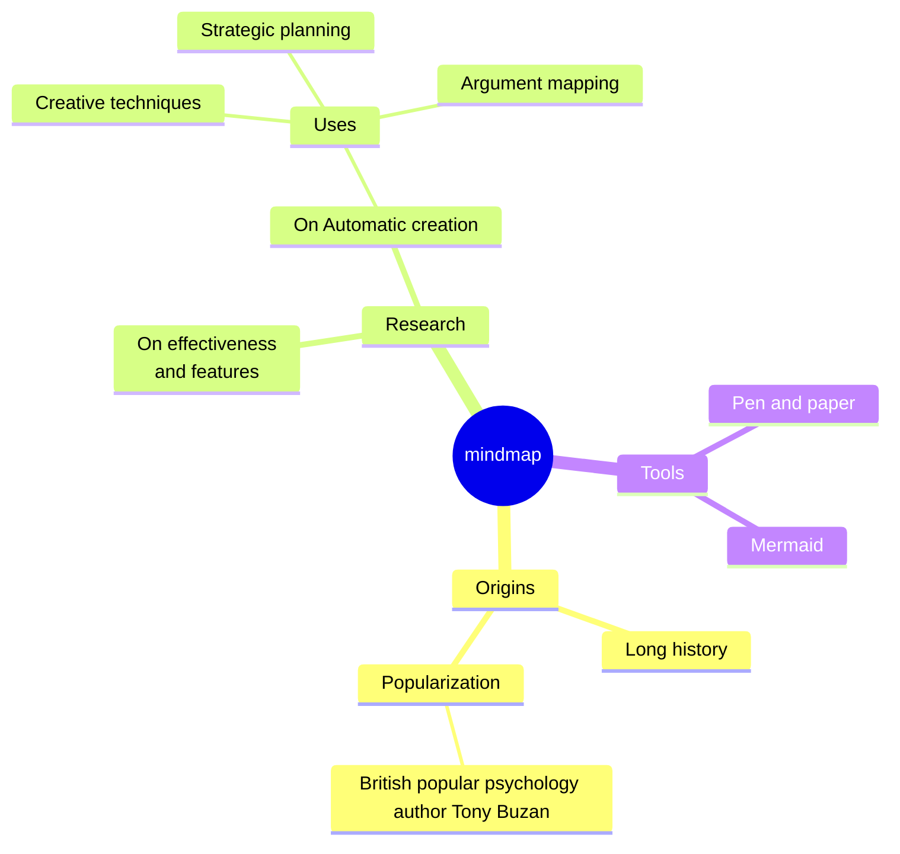

# HESA 2024/25 to 2025/26 Schema Impact Analysis  
*Student Record 24056 → 25056*

---

## 1. Executive Summary  

This updated report analyses **actual HESA Student record schemas**:

- `24056_1_2_0.xsd` – Student 2024/25  
- `25056_1_0_0.xsd` – Student 2025/26  

and combines this with relevant external documentation and consultation outputs to provide a **concrete impact assessment** on institutional systems and data flows.

### Headline schema changes (XSD-level)

1. **Removal of the SessionYear entity and SESSIONYEARID link**  
   - `SessionYear` is present as a top-level element in 24056 and is **removed** in 25056.  
   - The `SESSIONYEARID` child field is removed from `StudentCourseSession`.  
   - This aligns with consultation proposals to remove the SessionYear entity and simplify the StudentCourseSession/SessionYear model for future years.

2. **New RegistrationRole entity**  
   - New top-level element `RegistrationRole` with child `REGBODYID` and a new code list `RegistrationRole_REGBODYID_CodeType` (codes `5043`, `5044`, `5057`).  

3. **EntryProfile and occupation coding rationalisation**  
   - `EntryProfile` in 24056 carries **both** `SOC2010` and `SOC2020`; in 25056, `SOC2010` is removed and only `SOC2020` remains.  

4. **Engagement (initial teacher education / school-related fields)**  
   - `EMPLOYINGSCHOOL`, `ENTRYRTE` and `LEADSCHOOL` fields are present in `Engagement` in 24056 and are **removed** in 25056.  

5. **Code-list changes (selected areas)**  
   - **New codes added** for highest qualification on entry (`HIGHESTQOE`) and qualification types.  
   - **Legacy/rare codes removed** for certain initiatives, accreditation aims, awarding body accreditations and special country/nation codes (including removal of code `XL` from several country/nation lists).  

6. **No other structural element-level changes**  
   - Apart from the **SessionYear removal**, **RegistrationRole addition**, and the specific child/field deletions listed above, the entity set and field structures (names, min/maxOccurs, types) are otherwise stable between these schema versions.  

### Implications for your systems

- **Data model**: withdraw all use of SessionYear as a physical entity and drop the `SESSIONYEARID` link from HESA-style staging tables and reporting views.  
- **Business logic**: any business rules and KPIs that rely on SessionYear (e.g. 12-month FTE calculations at SessionYear level) must be **re-implemented using StudentCourseSession and date logic**.  
- **Teacher training and school-based provision**: retire `EMPLOYINGSCHOOL`, `ENTRYRTE`, `LEADSCHOOL` and map any business usage of those fields to alternative data items or local fields.  
- **Reference data management**: manage rollout of new/retired codes for HIGHESTQOE, qualification type, accreditation aims, initiatives, and country/nation codes.  
- **Regulatory context**: 25056 is formally an **“annual update”** to the Student record, not a fundamental redesign, but the SessionYear removal and related code-list changes constitute **non-trivial medium–high impact work** for data models and ETL.  

A phase-based migration roadmap and backlog are provided in Sections 8–9.  

---

## 2. Context and Objectives  

### 2.1 Context  

The HESA Student record under **Data Futures** (22056 onwards) is now established as the primary regulatory record. The **24056 coding manual** and associated support guides define the schema and validation landscape for academic year 2024/25.  

For **25056 (2025/26)**:

- Changes are positioned as an **annual update**, allowing targeted adjustments to fields, valid entries and guidance.  
- Consultation on the StudentCourseSession and SessionYear model explored simplifying the lifecycle model, including a proposal to remove SessionYear.  
- OfS and Jisc are progressing an **expansion of the student record** to cover partnership and TNE students, with implementation around 2025/26.  
- The **Student collection notice** was updated on 31 July 2025, applying to 25056 and previous years, and sets out data protection and processing expectations.  

### 2.2 Objectives  

This report:

1. Compares **actual XSDs** (24056_1_2_0 vs 25056_1_0_0) to identify concrete schema differences.  
2. Assesses impact on:  
   - Core student records system and HESA extract structures  
   - Data warehouse and semantic layer  
   - Data quality rules and regulatory outputs (HESA, OfS, ILR-adjacent metrics)  
3. Proposes a migration roadmap and backlog to support a controlled transition to 25056-compliant processing.  

---

## 3. Methodology and Assumptions  

### 3.1 Methodology  

1. **XSD technical comparison**  
   - Parsed both provided XSDs to extract:  
     - Top-level elements (entities)  
     - Child element sets (names, types, min/maxOccurs) for each key entity  
     - All `xs:simpleType` definitions (base type, enumerations, ranges, patterns).  
   - Computed:  
     - Elements added/removed between 24056 and 25056  
     - Entity-level structural differences (fields added/removed)  
     - Code lists with changed enumerated values.  

2. **External triangulation**  
   - Cross-checked structural findings against:  
     - HESA 24056 Student record overview and support guidance  
     - Consultation and outcome material on StudentCourseSession/SessionYear and annual updates  
     - Sector responses (e.g. IHE) and OfS documents on student record expansion and regulatory use.  

3. **Impact mapping**  
   - Mapped field- and entity-level changes to a generic HEI architecture (SRS → HESA staging → warehouse → regulatory outputs) and to operational processes in Registry, Planning, Data Quality and IT.  

### 3.2 Assumptions  

- No unobserved changes exist outside the supplied XSD versions (e.g. later minor schema patches).  
- Quality rules, OVT logic and textual guidance may introduce further nuance but **cannot contradict the XSD-level constraints** used for this analysis.  
- The institution currently operates a **24056-compliant pipeline** with HESA-style staging tables and/or direct schema mapping in the warehouse.  

---

## 4. Comparative Overview – Key Concrete Changes  

Based on the XSD comparison, the following **schema-level** changes are confirmed between 24056_1_2_0 and 25056_1_0_0:

1. **Top-level entities**  
   - `SessionYear` **removed** as a top-level element.  
   - `RegistrationRole` **added** as a new top-level element.  
   - All other top-level entities (e.g. `Student`, `Course`, `Engagement`, `EntryProfile`, `StudentCourseSession`, `OffVenueActivity`, etc.) remain present.  

2. **StudentCourseSession**  
   - Field `SESSIONYEARID` **removed** from `StudentCourseSession` in 25056; `SCSESSIONID` persists.  
   - No other SCS fields change type or cardinality.  

3. **Engagement**  
   - Fields removed in 25056:  
     - `EMPLOYINGSCHOOL`  
     - `ENTRYRTE`  
     - `LEADSCHOOL`  
   - Remaining Engagement fields (e.g. `NUMHUS`, `ENGSTARTDATE`, `ENGEXPECTEDENDDATE`, `FEESTATUS`, `FEEELIG`, `INCOMINGEXCHANGE`, `NHSEMP`, etc.) retain their types and cardinalities.  

4. **EntryProfile**  
   - Field `SOC2010` removed; `SOC2020` retained.  
   - `EntryProfile_SOC2010_CodeType` removed; `EntryProfile_SOC2020_CodeType` remains.  
   - `HIGHESTQOE` retains the same structure but its code list gains two additional codes.  

5. **New RegistrationRole entity**  
   - `RegistrationRole` has a single required child field `REGBODYID` of type `RegistrationRole_REGBODYID_Type`.  
   - New `RegistrationRole_REGBODYID_CodeType` enumerates three codes (`5043`, `5044`, `5057`), representing registration bodies as defined in the coding manual.  

6. **Code-list–only changes** (no structural change to the field itself)  
   - **CourseInitiative_COURSEINITID_CodeType** – one initiative code removed.  
   - **StudentInitiative_STUINITID_CodeType** – seven initiative codes removed.  
   - **StudentAccreditationAim_STUACCID_CodeType** – 12 accreditation aim codes removed.  
   - **QualificationAwardAccreditation_QUALAWARDACCID_CodeType** – 12 awarding body accreditation codes removed.  
   - **EntryQualificationAward_QUALTYPEID_CodeType** – two codes removed, many new qualification type codes added (net increase).  
   - **EntryProfile_HIGHESTQOE_CodeType** – two new valid entries.  
   - **EntryProfile_PERMADDCOUNTRY_CodeType**, **OffVenueActivity_COUNTRY_CodeType**, **Student_NATION_CodeType** – code `XL` removed from country/nation-related lists.  

7. **No changes in cardinality or base type**  
   - For entities and fields other than those listed, **minOccurs, maxOccurs and base types remain unchanged** between these schema versions.  

---

## 5. Feature & Capability Matrix (Schema-Level)  

| Area / Entity                                    | 24056_1_2_0                                                | 25056_1_0_0                                                | Impact Level |
|--------------------------------------------------|------------------------------------------------------------|------------------------------------------------------------|-------------|
| **SessionYear (entity)**                         | Present as top-level entity with `SESSIONYEARID`, `SYSTARTDATE`, `SYENDDATE`. | **Removed** as top-level entity.                           | High        |
| **StudentCourseSession structure**               | Contains `SESSIONYEARID` linking to SessionYear.           | `SESSIONYEARID` **removed**; SCS stands alone.             | High        |
| **Engagement – school-related fields**           | Fields `EMPLOYINGSCHOOL`, `ENTRYRTE`, `LEADSCHOOL` present. | All three fields **removed**.                              | Medium–High |
| **EntryProfile – occupation coding**             | Both `SOC2010` and `SOC2020` present; SOC2010 codes defined. | Only `SOC2020` present; `SOC2010` and its code list removed. | Medium      |
| **RegistrationRole**                             | Not present.                                               | New entity `RegistrationRole` with `REGBODYID` field and new code list. | Medium      |
| **Qualification / accreditation / initiative codes** | Larger sets of codes; several legacy codes still valid.   | Certain legacy codes removed; new qualification type codes added. | Medium      |
| **Country / nation code lists**                  | Includes special code `XL` in several lists.               | `XL` removed from permanent address, off-venue and nation code lists. | Low–Medium  |
| **Other entities (Student, Course, Module, etc.)** | Structures and code lists stable at XSD level.             | Structures stable; guidance/quality rules may still change. | Low         |

Impact Level refers to typical systems impact; local usage may increase or decrease this.  

---

## 6. Analysis & Findings  

### 6.1 SessionYear Removal and StudentCourseSession  

**What changed**

- `SessionYear` is removed as an entity, and `SESSIONYEARID` is removed from `StudentCourseSession`.  
- This implements the direction signalled in HESA consultations, where the **value and burden of SessionYear** was questioned and proposals were made to remove the entity and/or associated flags in future specifications.  

**System implications**

- **Physical data model**  
  - HESA-style schema databases and staging layers must **drop the SessionYear table** and remove foreign keys based on `SESSIONYEARID`.  
  - Any warehouse fact tables keyed by SessionYear (e.g. session-year-level FTE facts) will need redesign to use **StudentCourseSession plus dates or reporting-year flags** instead.  

- **Business logic**  
  - Rules that rely on SessionYear to enforce **12-month FTE or activity windows** must be re-written to derive those windows from StudentCourseSession start/end dates, or from reporting-year–derived fields.  
  - Where SessionYear was used to model **dormancy or interruptions**, equivalent behaviour will need to be expressed through SCS status and date logic and/or local tables.  

- **Reporting & analytics**  
  - Any analyses that currently group by SessionYear (persistence, continuation, etc.) need to be revisited and re-validated to ensure consistency with regulatory definitions.  

### 6.2 Engagement Changes (School / ITT Fields)  

**What changed**

- The following Engagement fields are removed in 25056:  
  - `EMPLOYINGSCHOOL`  
  - `ENTRYRTE`  
  - `LEADSCHOOL`  

**System implications**

- These are typically used for **teacher training and school-based provision**. Their removal implies that:  
  - Data entry forms and SRS configuration capturing these fields **only for the HESA return** can be simplified or retired.  
  - If local processes or external returns (e.g. internal ITE performance monitoring, school partnerships dashboards) still require these data, you may need to:  
    - Retain them in local schemas but **decouple from HESA exports**, or  
    - Source the same concepts from other fields or external systems.  

- Internal validation rules expecting these fields to be populated must be removed or repurposed.  

### 6.3 EntryProfile – SOC2010 → SOC2020  

**What changed**

- In 24056, `EntryProfile` carries both `SOC2010` and `SOC2020` fields, with corresponding code lists.  
- In 25056, `SOC2010` and `EntryProfile_SOC2010_CodeType` are removed; only `SOC2020` remains.  

**System implications**

- **Data capture**: any student entry processes that still record occupation using SOC2010 for HESA purposes must be switched to **SOC2020-only coding**.  
- **Reference data**:  
  - SOC2010 lookup tables can be deprecated for new cohorts, retaining only for historical reporting.  
  - SOC2020 lookups remain and should be treated as the single standard.  
- **Analytics**:  
  - Historical time series may combine SOC2010 and SOC2020; ensure that any mapping or recoding methodology is documented for longitudinal analysis.  

### 6.4 New RegistrationRole Entity  

**What changed**

- New entity `RegistrationRole` with:  
  - Single required field `REGBODYID` (Registration body identifier).  
  - New `RegistrationRole_REGBODYID_CodeType` with three valid codes (`5043`, `5044`, `5057`).  

**System implications**

- **Data model**: introduce a small table corresponding to RegistrationRole, keyed by `REGBODYID`, with a relationship to the relevant parent entity as specified in the coding manual (e.g. linking to course or student-level data depending on design).  
- **Reference data**:  
  - Implement a controlled code list mapping `5043` / `5044` / `5057` to their named registration bodies as per HESA documentation.  
- **ETL and reporting**:  
  - Extend ETL to populate RegistrationRole from appropriate source systems (e.g. ITE or professional registration modules).  

### 6.5 Code-list Changes in Initiatives, Accreditation and Qualifications  

**What changed (high level)**  

- **Initiatives**  
  - `CourseInitiative_COURSEINITID_CodeType`: one course initiative code removed.  
  - `StudentInitiative_STUINITID_CodeType`: seven student initiative codes removed.  
- **Accreditation**  
  - `StudentAccreditationAim_STUACCID_CodeType`: 12 codes removed.  
  - `QualificationAwardAccreditation_QUALAWARDACCID_CodeType`: 12 codes removed.  
- **Qualification types**  
  - `EntryQualificationAward_QUALTYPEID_CodeType`: two codes removed, numerous new entries added (net increase in enumeration size).  
- **Highest qualification on entry**  
  - `EntryProfile_HIGHESTQOE_CodeType`: two new codes added.  

**System implications**

- **Reference data governance**  
  - Update central code tables and align with 25056 code sets.  
  - Implement **versioning** (24056 vs 25056 codes) to preserve historical accuracy.  
- **Data quality**  
  - Define transition rules where codes are retired (e.g. map retired initiative codes to closest current equivalents or treat as historic-only).  
  - Validate that data entry UIs and imports no longer permit deprecated values.  
- **Reporting**  
  - Review any reports or KPIs that filter or group by specific codes (e.g. a particular initiative or accreditation code).  

### 6.6 Country / Nation Code Adjustments  

**What changed**

- The special code `XL` is removed from:  
  - `EntryProfile_PERMADDCOUNTRY_CodeType`  
  - `OffVenueActivity_COUNTRY_CodeType`  
  - `Student_NATION_CodeType`  

**System implications**

- **Validation**: 24056-compliant data using `XL` must be migrated or remapped to a permitted value (likely a generic “unknown” or “not known” category, depending on coding manual guidance).  
- **UI**: drop `XL` from drop-downs and validation lists for new records.  

### 6.7 Process, Quality Rules and Privacy Context  

- 25056 changes form part of the **annual update process**, which typically focuses on field updates and code lists rather than a new data model.  
- Quality rules changes for 25056 are partly foreshadowed in HESA documentation on rules “to be considered for 25056”, noting that some low-priority new or amended rules were deferred from 24056.  
- The updated **Student collection notice (31 July 2025)** applies to 25056 and previous years; institutions must ensure their own privacy notices and DPIAs align with the new wording.  

---

## 7. Recommendations  

### 7.1 Data Model and ETL  

1. **Retire SessionYear from HESA-facing schemas**  
   - Drop the SessionYear table in HESA staging and remove `SESSIONYEARID` columns and foreign keys.  
   - Rework ETL so that SCS is no longer dependent on SessionYear; instead, derive reporting-year semantics from dates or local year flags.  

2. **Refactor SCS-based business logic**  
   - Rewrite logic that uses SessionYear to define **reporting periods, FTE and dormancy** to use SCS start/end dates and institutional reference periods.  

3. **Introduce RegistrationRole**  
   - Create new table(s) and ETL to support `RegistrationRole` and `REGBODYID`.  
   - Implement mapping from source systems (e.g. ITT or professional registration modules) to the new code list.  

4. **Align EntryProfile and Engagement structures**  
   - Remove `SOC2010` from new data capture and ensure `SOC2020` is the only occupation field populated.  
   - Remove `EMPLOYINGSCHOOL`, `ENTRYRTE` and `LEADSCHOOL` from HESA export logic and, if neces
